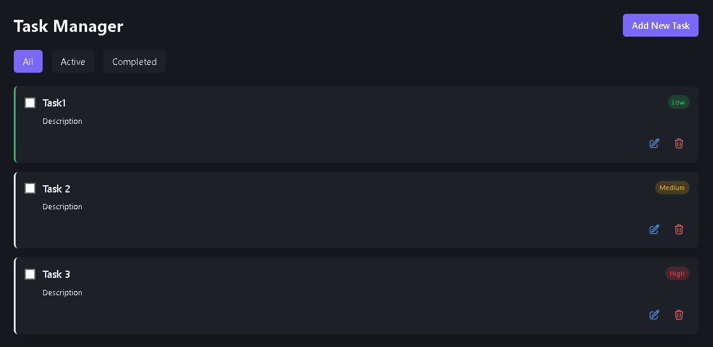

<h1 align="center">
  FocusForge
  
</h1>

FocusForge is a productivity tool that combines time management and task tracking to help users stay focused, organized, and maximize efficiency.

## Features:

1. **Task Management**  
   Efficient task creation, priority setting, and tracking.
   

   
2. **Focus Timer**  
   Helps users maintain focus with Pomodoro sessions.

3. **Analytics**  
<<<<<<< HEAD
   View insights with daily/weekly heatmaps and stats.
=======
   View insights with daily/weekly heatmaps and stats.

## Technology Stack:
- **Frontend:** React (Vite)
- **Styling:** Tailwind CSS, CSS Modules
- **State Management:** Context API
- **Other Libraries:** `date-fns`, `lucide-react`, `react-router-dom`

>>>>>>> b62938034c74264537650c92968548b42b7d2ee8
